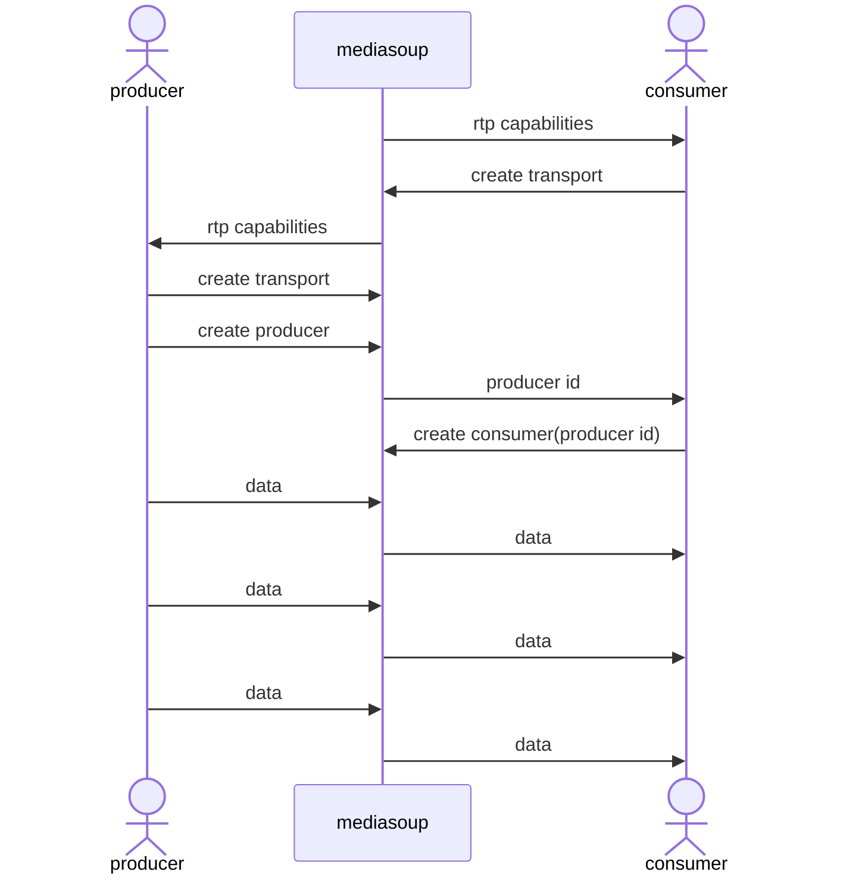

# mediasoup でdatachannel を中継する

参考 https://www.alpha.co.jp/blog/202205_02

```
producer ==> ws ==> mediasoup <== ws <== consumer
         (signaling)          (signaling)

[WebSocket] new connection
[1] --> {"jsonrpc":"2.0","method":"rtp-capabilities"}
[1] <== create-consumer-transport

[WebSocket] new connection
[2] --> {"jsonrpc":"2.0","method":"rtp-capabilities"}
[2] <== create-producer-transport

[2] <== connect-producer-transport
[broadcast to consumer]
[1] --> {"jsonrpc":"2.0","method":"new-producer"}

[2] <== produce-data
[1] <== consume-data
[1] <== connect-consumer-transport
```



## prebuilt

- Windows11
- python3
- vs2022

```sh
MEDIASOUP_SKIP_WORKER_PREBUILT_DOWNLOAD="true" npm install mediasoup@3
```

で install はできた。

## run

```sh
> npx vite-node mediasoup/server.ts
```

