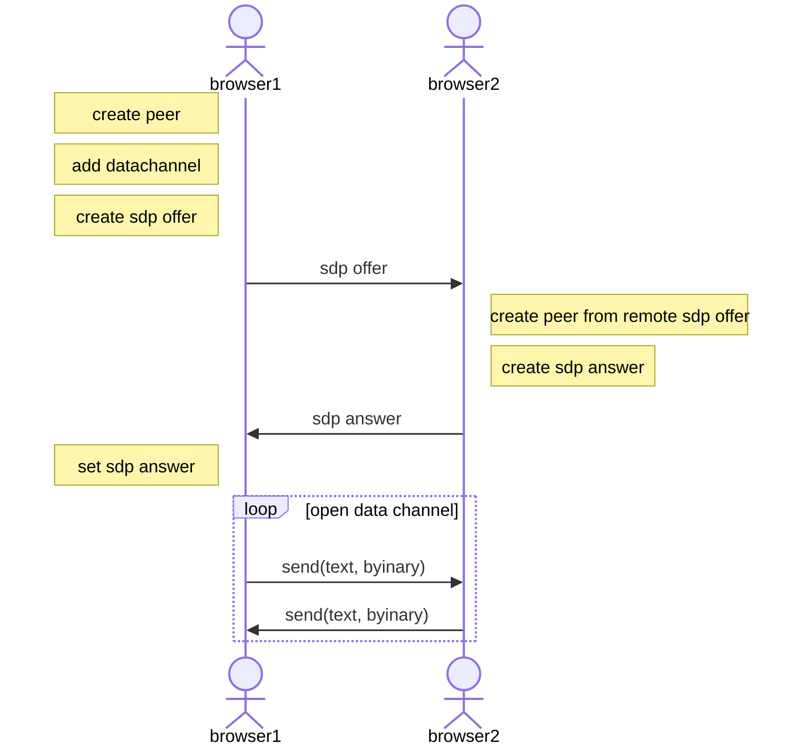

# コピペによる手動シグナリング

最初は webcam とかやらずに、datachannel を使ってテキストのやり取りから始めるのが簡単。
webcam などのデバイスアクセスに https が必要になって手順が増えるのである。
あと datachannel の方が SDP が小さいので手動コピペには好都合。

参考 https://ja.tech.jar.jp/webrtc/datachannel.html



## Vanilla ICE 方式
sdp に すべての ice candidate を含ませる方式。
コピペが１往復で済みます。

# TODO
- [ ] 有効になった ICE candidate の詳細を表示

# 構成

- index.html
  - index.js

```
minimum_datachannel> npx http-server
```
