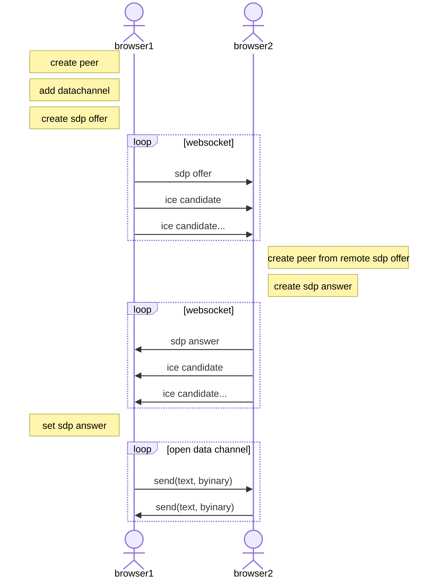

# WebSocket で SDP をやりとする

[手動signaling: datachannel](../minimum_datachannel/README.md) ではコピペで SDP をやりとしていたが、 このやり取りを WebScocket 経由にする。

それぞれの browser はとりあえず中継にサーバーに接続し websocket を開始する。

とりあえず `offer` を待ち受ける。
`offer` を送った場合は、 以降 `answer` を待ち受ける。
websocket サーバーが予期にはからってくれるであろう。

参考 https://inon29.hateblo.jp/entry/2020/02/09/124406

上記サイトの例を参考に、mediachannel を datachannel に置き換えてみます。



## Trickle ICE 方式
SDP には IceCandidate を含ませずに先行して送る。
後から小出しにひとつずつ IceCandidate を送る。

# 構成

- index.html
  - index.js
- server.js

html の host
```
ws_datachannel> npx http-server
```

wesocket server
```
ws_datachannel> node server.js
```

